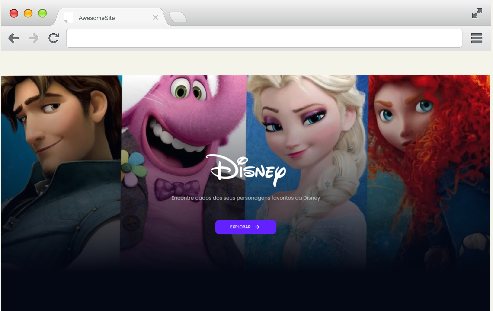

# HiLab - Desafio Front-End
Informações sobre o desafio
[aqui](https://obvious-kileskus-1e3.notion.site/Desafio-front-end-6f2763b3558d422595b0cb649714906f).

<div align='center'>
    
</div>

<br>

## ⚡Aplicativo online
Versão online do
[Disney personagens](https://hilab-frontend.vercel.app/showlist) hospedado na [Vercel](https://vercel.com/).

<br>

## 👾Tecnologias
- [React](https://pt-br.reactjs.org/)
- [TypeScript](https://www.typescriptlang.org/)
- [Chakra UI](https://chakra-ui.com/)
- [Axios](https://axios-http.com/ptbr/docs/intro)

Bibliotecas complementares: `react-router-dom` e `react-icons`.

<br>

## 🧶Executando o projeto
Após clonar o repositório em sua máquina local, use um terminal para navegar até a pasta onde você clonou o repositório e execute o seguinte comando:

```bash
$ yarn
# ou
$ npm install
```
para instalar as dependências. Em seguida, você precisa iniciar o servidor de desenvolvimento, usando o seguinte comando:

```bash
yarn start
# ou
npm run dev
```
Abra [http://localhost:3000](http://localhost:3000) para visualizar o projeto no navegador.

É recomendável que você use o Yarn em vez do NPM, já que o projeto foi desenvolvido usando o Yarn como gerenciador de pacotes.

<br>

## ⚛️RCA
Este projeto foi inicializado com
[Create React App](https://github.com/facebook/create-react-app).

<br>

### Code by [@ecthon](https://www.linkedin.com/in/ecthon/).
